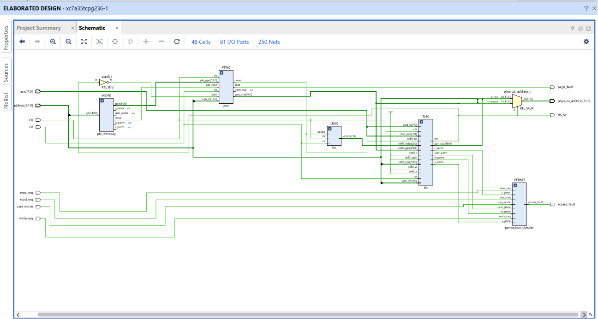
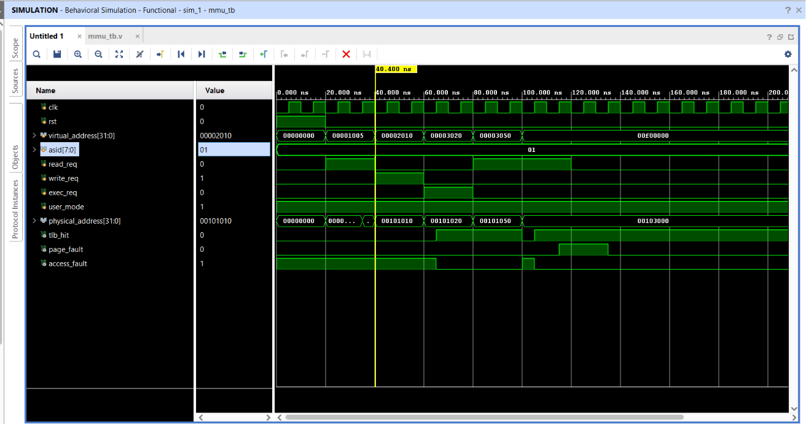

<div align="center">


<br>


<p>


</p>



</div>

---

# 🚀 Overview

This project implements a **RISC-Style Memory Management Unit (MMU)** in **Verilog HDL**, demonstrating how modern processors translate virtual addresses into physical addresses while enforcing memory protection and access permissions.

The design includes:

✅ Translation Lookaside Buffer (TLB)

✅ Address Space Identifiers (ASIDs)

✅ Page Table Walker (PTW)

✅ Permission Checking (R/W/X)

✅ User/Supervisor Protection

✅ TLB Refill Logic

✅ LRU-Based Replacement

✅ Fault Detection & Handling

The complete design was verified through behavioral simulation and synthesized on an **AMD Artix-7 FPGA** using **Vivado 2025.2**.

---

# 🔥 Why This Project?

Modern CPUs do not directly access physical memory.

Instead:

```text
Virtual Address
       ↓
MMU
       ↓
Physical Address
```

The MMU is responsible for:

* Fast address translation
* Memory protection
* Process isolation
* Permission enforcement
* TLB management

These concepts form the foundation of modern operating systems and processor architectures.

---

# ✨ Features

| Feature                        | Status |
| ------------------------------ | ------ |
| 32-bit Virtual Addressing      | ✅      |
| 4 KB Page Size                 | ✅      |
| Virtual → Physical Translation | ✅      |
| TLB Lookup                     | ✅      |
| TLB Refill                     | ✅      |
| PTW FSM                        | ✅      |
| ASID Support                   | ✅      |
| Read Permission                | ✅      |
| Write Permission               | ✅      |
| Execute Permission             | ✅      |
| User/Supervisor Protection     | ✅      |
| Page Fault Handling            | ✅      |
| Access Fault Handling          | ✅      |
| Vivado Synthesis               | ✅      |

---

# 🏗️ MMU Architecture

```text
                    CPU Request
                         │
                         ▼
                ┌────────────────┐
                │      TLB       │
                └───────┬────────┘
                        │
               Hit      │      Miss
                        ▼
                ┌────────────────┐
                │      PTW       │
                └───────┬────────┘
                        ▼
                ┌────────────────┐
                │  PTE Memory    │
                └───────┬────────┘
                        ▼
                ┌────────────────┐
                │      LRU       │
                └───────┬────────┘
                        ▼
                ┌────────────────┐
                │ Permission Ctl │
                └───────┬────────┘
                        ▼
                Physical Address
```

---

# 📂 Project Structure

```text
MMU-Design-Verilog-HDL/

├── rtl/
│   ├── mmu_top.v
│   ├── tlb.v
│   ├── lru.v
│   ├── ptw.v
│   ├── pte_memory.v
│   └── permission_checker.v
│
├── tb/
│   └── mmu_tb.v
│
├── constraints/
│   └── mmu_top.xdc
│
├── scripts/
│   └── yosys_synth.ys
│
├── simulation/
│   ├── waveform.png
│   └── simulation_notes.md
│
├── reports/
│   └── mmu_top_utilization_synth.txt
│
├── images/
│   └── rtl_schematic.png
│
├── docs/
│   ├── architecture.md
│   ├── verification_plan.md
│   └── synthesis_summary.md
│
├── README.md
└── .gitignore
```

---

# 🧪 Verification

The MMU was verified using a dedicated Verilog testbench covering:

* TLB Lookup
* Translation Requests
* TLB Misses
* PTW Operation
* Access Permissions
* Page Fault Generation
* Access Fault Generation

### Behavioral Simulation



---

# ⚙️ FPGA Synthesis Results

**Target Device:** Artix-7 (xc7a35tcpg236-1)

<div align="center">


</div>

| Resource  | Used | Available |
| --------- | ---- | --------- |
| LUTs      | 142  | 20,800    |
| Registers | 266  | 41,600    |
| DSPs      | 0    | 90        |
| BRAM      | 0    | 50        |

The design utilizes less than **1% of available FPGA resources**, making it lightweight and scalable.

---

# 🎓 Concepts Demonstrated

* Verilog HDL
* FPGA Design Flow
* Virtual Memory Systems
* Translation Lookaside Buffer (TLB)
* Page Table Walker (PTW)
* Address Space Identifiers (ASID)
* Memory Protection
* Permission Management
* RTL Design
* Functional Verification
* FPGA Synthesis

---

# 🚀 Getting Started

```bash
git clone https://github.com/shravanisahare14-web/MMU-Design-Verilog-HDL.git
```

### Vivado Flow

1. Create Project
2. Add RTL Files
3. Set `mmu_top` as Top Module
4. Run Behavioral Simulation
5. Open RTL Schematic
6. Run Synthesis
7. Generate Reports

---

# 🔮 Future Improvements

* Fully Associative TLB
* AXI-Lite Memory Interface
* Multi-Level Page Tables
* RISC-V Core Integration
* Advanced LRU Policies
* Timing Analysis using OpenSTA

---

<div align="center">

### 💙 Built for FPGA • VLSI • Computer Architecture Engineering

</div>
